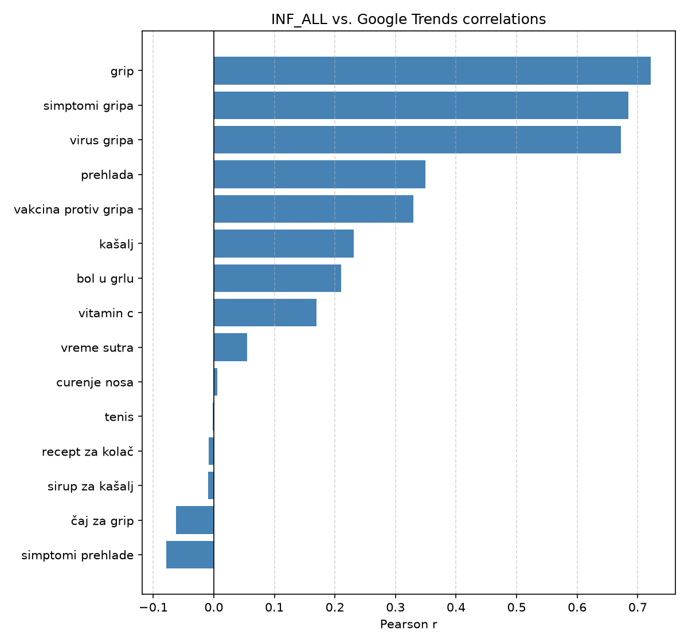
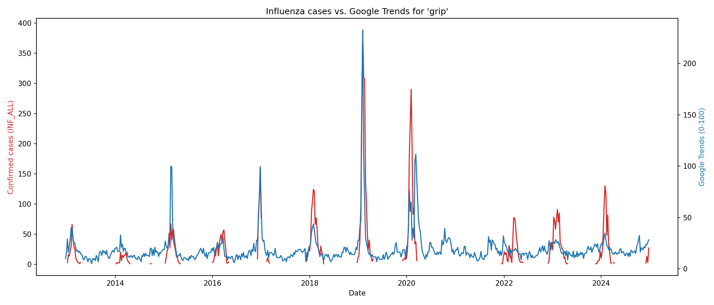
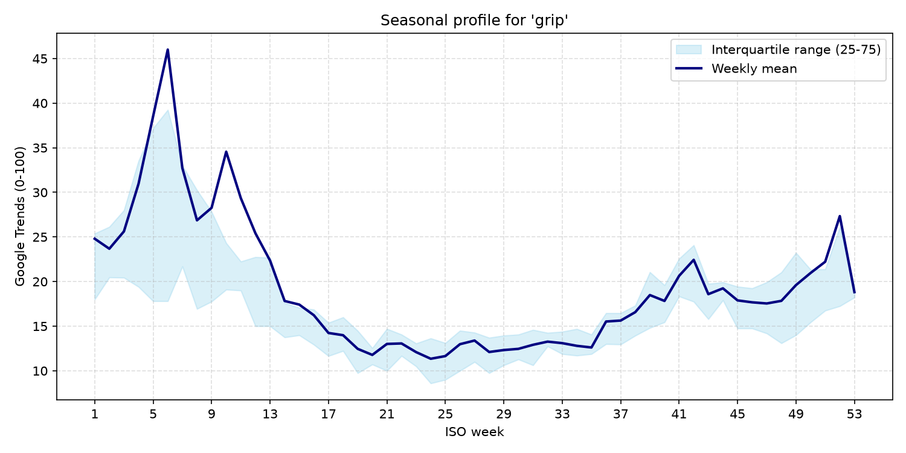

# Influenza Trends Serbia


Automated Google Trends data extraction and analysis for influenza-related search interest in Serbia. This repository is structured as a reproducible digital epidemiology and data science portfolio project exploring whether online search behavior can provide a complementary signal for influenza surveillance.

## Author

**Author:** Nenad Ljubenovic, MD  
**Affiliation:** Department of Epidemiology, Military Medical Academy, Belgrade, Serbia  
**Contact:** nenad@ljubenovic.com  
**License:** MIT

## Key Message

This project demonstrates how Google Trends data can be used as a complementary digital epidemiology signal for influenza-related public interest and potential surveillance support in Serbia.

## Project Overview

The workflow collects, processes, merges, and analyzes Google Trends signals related to influenza in Serbia from 2013 to 2026. It focuses on weekly search activity for influenza-related symptoms, treatment terms, prevention terms, and negative controls, with optional comparison against influenza surveillance data.

The project is intended for GitHub visitors, data science portfolio reviewers, public health researchers, and academic collaborators interested in reproducible public health analytics.

## Key Findings

Based on the existing generated reports in `outputs/reports/`:

- Influenza-specific search terms showed the strongest positive correlations with the available influenza indicator `INF_ALL`, especially `grip` (`r = 0.722`), `simptomi gripa` (`r = 0.685`), and `virus gripa` (`r = 0.672`).
- Broader or less specific terms, such as `prehlada`, `kašalj`, and `bol u grlu`, showed weaker positive correlations.
- Several terms had limited or missing usable paired observations in the generated correlation report and should not be overinterpreted.
- Lagged correlation results are exploratory and require validation against official surveillance data before operational use.

These findings describe associations in the existing project outputs only. They should not be interpreted as evidence that Google Trends measures confirmed influenza incidence.

## Workflow Overview


## Repository Structure

```text
influenza-trends-serbia/
├── README.md
├── requirements.txt
├── LICENSE
├── src/
├── notebooks/
├── data/
├── outputs/
└── docs/
```

The current organization already follows the expected structure: source code is in `src/`, notebooks are in `notebooks/`, figures are in `outputs/figures/`, and summary reports are in `outputs/reports/`.

## Main Scripts

- [`src/influenza_gt.py`](src/influenza_gt.py) collects weekly Google Trends data for predefined influenza-related and control keywords in Serbia, using overlapping time windows and overlap-based rescaling.
- [`src/merge_trends_data.py`](src/merge_trends_data.py) merges weekly Google Trends data with influenza surveillance data by ISO year and ISO week, producing long and wide analytical datasets.
- [`src/analyze_influenza_trends.py`](src/analyze_influenza_trends.py) computes exploratory correlations and generates figures comparing Google Trends signals with influenza indicators.
- [`src/summarize_influenza_trends.py`](src/summarize_influenza_trends.py) creates descriptive keyword summaries, keyword-level correlations, and lagged correlation reports.
- [`src/operational_influenza_monitoring.py`](src/operational_influenza_monitoring.py) explores operational monitoring signals using selected influenza-related keywords and lag analysis.

## Notebook

- [`notebooks/influenza_models.ipynb`](notebooks/influenza_models.ipynb)

## Installation

Create and activate a virtual environment:

```bash
python3 -m venv .venv
source .venv/bin/activate
```

Install dependencies:

```bash
pip install -r requirements.txt
```

## How to Run

Run commands from the repository root.

1. Collect Google Trends data:

```bash
python src/influenza_gt.py
```

2. Merge Google Trends data with influenza surveillance data:

```bash
python src/merge_trends_data.py
```

3. Generate exploratory correlations and figures:

```bash
python src/analyze_influenza_trends.py --no-show
```

4. Create summary tables and lagged correlation outputs:

```bash
python src/summarize_influenza_trends.py
```

5. Run operational lag monitoring:

```bash
python src/operational_influenza_monitoring.py
```

## Outputs

Typical generated outputs include:

- `data/processed/google_trends_weekly_serbia.csv`
- `data/processed/merged_trends_influenza_long.csv`
- `data/processed/merged_trends_influenza_wide.csv`
- `outputs/reports/keyword_summary.csv`
- `outputs/reports/keyword_correlations.csv`
- `outputs/reports/lagged_correlations.csv`
- `outputs/figures/*.png`

## Example Figures

The following example figures are generated outputs already present in `outputs/figures/`.



*Figure 1. Pearson correlations between available influenza surveillance counts and Google Trends keyword signals.*



*Figure 2. Weekly Google Trends signal for `grip` compared with the available influenza indicator.*



*Figure 3. Seasonal weekly profile for the `grip` search term across the study period.*

## Reproducibility Notes

- Google Trends data are collected through `pytrends`, an unofficial interface to Google Trends. Repeated requests may produce small differences because Google Trends data are normalized and sampled.
- The processed Google Trends dataset is stored in `data/processed/google_trends_weekly_serbia.csv`.
- The default surveillance workbook `data/raw/DataExport_100625.xlsx` is intentionally ignored by Git and must be supplied locally to regenerate merged outputs.
- Merged analytical datasets are generated in `data/processed/` after combining Google Trends data with influenza surveillance data by ISO year and ISO week.
- Figures and CSV reports are generated outputs and can be recreated from the scripts in `src/`.
- Surveillance data availability and sharing permissions should be reviewed before publication or reuse.
- Results are exploratory and should be validated with official surveillance data before being used for public health decision-making.

## Limitations

- Google Trends reflects search behavior, not confirmed influenza cases.
- Search volume may be influenced by media coverage, public awareness, and changes in internet use.
- Google Trends values are normalized and should be interpreted carefully.
- Official surveillance data are needed for validation.

## Future Work

- Compare trends with official influenza surveillance data.
- Explore lagged correlations.
- Add forecasting models.
- Build a small dashboard.
- Expand analysis to other respiratory infections.

## Portfolio Relevance

This project demonstrates practical skills in:

- Python programming
- Automated data collection
- Data cleaning and aggregation
- Time-series analysis
- Digital epidemiology
- Reproducible public health analytics

## Documentation

Additional workflow notes are available in [`docs/README.md`](docs/README.md).

## Citation

Citation metadata are available in [`CITATION.cff`](CITATION.cff).

## License

This project is released under the MIT License. See [`LICENSE`](LICENSE) for details.
